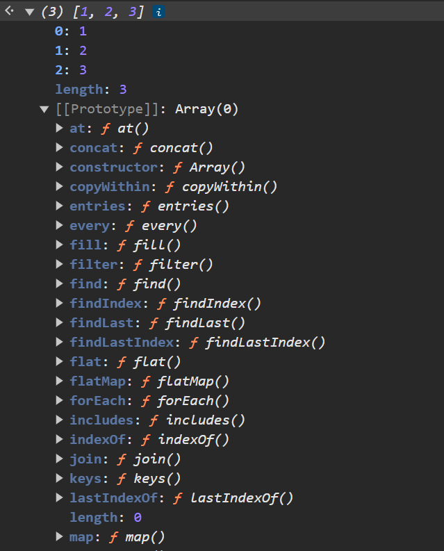

# More about Objects and Arrays & Prototypes

## Abstract Data Types

პროგრამირებაში არსებობს პროგრამის წერის ასეთი მიდგომა - ობიექტზე ორიენტირებული პროგრამირება. ეს მიდგომა მოიცავს ობიექტების გამოყენებას პროგრამის სტრუქტურის შესაქმნელად. ამ დროს გვაქვს კონკრეტული აბსტრაქტული ტიპი - კლასი - ანუ ობიექტების დამაგენერირებელი ქარხანა, რომელიც ზოგადად განსაზღვრავს ობიექტის შიგთავს, მის ფროფერთებსა და მეთოდებს ანუ ინტერფეისს. ამ ზოგადი კლასიდან შეგვიძლია მივიღოთ უამრავი კონკრეტული ობიექტი. ანალოგია მოცემულია ფოტოზეც:


## Methods

JavaScript-ში ობიექტის მეთოდები საშუალებას გვაძლევს, გავაერთიანოთ ფუნქციონალი და მონაცემები ერთ ობიექტში. ამ მაგალითში `person` არის ობიექტი, რომელსაც აქვს ორი თვისება (property): `name` და `age`. გარდა ამისა, მას გააჩნია sayHello მეთოდი, რომელიც მფლობელის სახელით აბრუნებს მოკითხვას.

```js
let person = {
  name: "Temo",
  age: 20,
  sayHello: function () {
    return `${this.name} says hello`;
  },
};
```

აქ sayHello მეთოდი გამოიყენებს this-ს, რათა მიწვდეს იმავე ობიექტის(იმ ობიექტის რომელსაც მეთოდი ეკუთვნის) name თვისებას, ასე რომ თუ name შეიცვლება, მეთოდი ყოველთვის მას შეესაბამება. (this არის თითის გაშვერა, იმის მაგივრად, რომ ობიექტს სახელით მივმართოთ, მისკენ ვიშვერთ თითს. ამ შემთხვევაში ობიექტის სახელის შეცვლის მერეც იმავე ობიექტს მივწვდებით)

მეთოდის გამოძახებისას, მაგალითად person.sayHello(), შედეგი იქნება:

```
"Temo says hello"
```

## Prototypes



ამ სურათში ნაჩვენებია JavaScript-ის მასივის ობიექტის პროტოტიპი და მისი სხვადასხვა მეთოდები, როგორიცაა `concat`, `map`, `filter`, `find`, `forEach`, და სხვა.

JavaScript-ში თითოეულ ობიექტს აქვს პროტოტიპი, რაც საშუალებას აძლევს მას მემკვიდრეობით მიიღოს მეთოდები და თვისებები მშობელი პროტოტიპიდან. მოცემულ შემთხვევაში, მასივი მემკვიდრეობით იღებს ფუნქციებს, რომლებიც ოპერაციებს ახორციელებენ მასივის ელემენტებზე.

პროტოტიპული მემკვიდრეობა JavaScript-ის ერთ-ერთი უნიკალური მახასიათებელია, რომელიც საშუალებას იძლევა, სხვადასხვა ობიექტებმა გაიზიარონ ერთნაირი მეთოდები, ამასთან, პროტოტიპი ცალკეულ ობიექტზე ნაკლებ მეხსიერებას მოითხოვს და კოდის ოპტიმიზაციას უწყობს ხელს.

უფრო მარტივად რომ ავხსნათ, პროტოტიპი არის რაიმე მნიშვნელობის ზოგადი ჩანახატი, რომელზეც ზედომან შენდება კონკრეტული მნიშვნელობები. აქაც შეგვიძლია გამოვიყენოთ კონსპექტის თავში მოთავსებული ფოტო.

ამ მაგალითში ნაჩვენებია პროტოტიპული მემკვიდრეობის გამოყენება JavaScript-ში.

```js
let protoRabbit = {
  speak(line) {
    console.log(`The ${this.type} rabbit says '${line}'`);
  },
};

let blackRabbit = Object.create(protoRabbit);
blackRabbit.type = "black";
blackRabbit.speak("I am fear and darkness");
// → The black rabbit says 'I am fear and darkness'
```

1. `protoRabbit` - ეს არის ობიექტი, რომელიც შეიცავს speak მეთოდს. ეს მეთოდი იღებს `line` პარამეტრს და კონსოლში გამოაქვს ტექსტი, რომელიც მოიცავს `this.type` მნიშვნელობას და გადმოცემულ `line` ტექსტს.
2. `blackRabbit` - ეს ობიექტი იქმნება `protoRabbit`-ის პროტოტიპის მეშვეობით, `Object.create(protoRabbit)` გამოყენებით. შედეგად, `blackRabbit` მემკვიდრეობით იღებს `speak` მეთოდს `protoRabbit`-დან.

შემდეგ კი, `blackRabbit`-ს ენიჭება type თვისება მნიშვნელობით `"black"`.

გამოძახება:
`blackRabbit.speak("I am fear and darkness");` გამოიძახებს `speak` მეთოდს, რომელიც გამოიყენებს `blackRabbit`-ის `type` თვისებას და კონსოლში გამოიტანს:

```
The black rabbit says 'I am fear and darkness'
```

## classes

ამ მაგალითში მოცემულია JavaScript-ში ობიექტების შექმნის ორი მეთოდი: Factory ფუნქციები და კლასები.

1. Factory ფუნქცია (`makeRabbit`)

- ფუნქცია makeRabbit ქმნის ახალ ობიექტს `protoRabbit` პროტოტიპის საფუძველზე.
- ეს ობიექტი იღებს `type` თვისებას, რომელიც ფუნქციაში გადაცემული პარამეტრის საფუძველზე განისაზღვრება.
- ბოლოს, ფუნქცია აბრუნებს ახალ ობიექტს.

```js
function makeRabbit(type) {
  let rabbit = Object.create(protoRabbit);
  rabbit.type = type;
  return rabbit;
}
```

2. კლასი (`Rabbit`)

- კლასები JavaScript-ში არის ობიექტზე დაფუძნებული პროგრამირების სტრუქტურა, რომელიც უფრო მკაფიო და თანამედროვე სინტაქსს გვთავაზობს.
- კლასი `Rabbit`-ის კონსტრუქტორი იღებს `type` პარამეტრს და ამ მნიშვნელობას ანიჭებს `type` თვისებას.
- კლასს ასევე აქვს `speak` მეთოდი, რომელიც გამოსახავს შეტყობინებას კონსოლში.

```js
class Rabbit {
  constructor(type) {
    this.type = type;
  }
  speak(line) {
    console.log(`The ${this.type} rabbit says '${line}'`);
  }
}
```

**გამოყენება**
`killerRabbit` ობიექტი იქმნება კლასის `Rabbit` საფუძველზე.

```js
let killerRabbit = new Rabbit("killer");
```

ამის შემდეგ, თუ `killerRabbit.speak("Beware!") `გამოვიძახებთ, კონსოლში გამოიტანს:

```js
The killer rabbit says 'Beware!'
```

**შედარება**

- Factory ფუნქცია: მარტივი და მოსახერხებელია, განსაკუთრებით იმ სიტუაციებში, როცა პროტოტიპის მეშვეობით გვსურს მემკვიდრეობა.
- კლასი: უფრო თანამედროვე და სტრუქტურირებული მიდგომაა, რომელიც კოდის წაკითხვასა და მართვას უფრო ამარტივებს, განსაკუთრებით მაშინ, როცა გვაქვს მრავალი ინსტანცია(instance ეწოდება კლასიდან ან factory ფუნქციიდან დაგენერირებულ ობიექტს) ან კომპლექსური ლოგიკა.

## Looping Objects

JavaScript-ში ობიექტების თვისებების გადავლა `for...in` ციკლის საშუალებით შეგვიძლია:

```js
let obj = {
  name: "temo",
  age: 20,
  profession: "FullStack Developer&Mentor",
};

for (let key in obj) {
  console.log(key);
}
```

**ახსნა**

- `obj` არის ობიექტი სამი თვისებით: `name`, `age` და `profession`.
- `for...in` ციკლი გადის ობიექტის ყველა თვისებაზე (ე.წ. `key`).
- თითოეულ იტერაციაზე `key` შეიცავს მიმდინარე თვისების სახელწოდებას.
- `console.log(key);` გამოიტანს თვისების სახელს კონსოლში.:

```
name
age
profession
```

ეს ტექნიკა სასარგებლოა, როცა გვჭირდება ობიექტის ყველა თვისების გადამოწმება ან მუშაობა თითოეულზე ინდივიდუალურად. თუმცა, უნდა გვახსოვდეს, რომ `for...in` ციკლი ასევე გაივლის ობიექტის პროტოტიპიდან მემკვიდრეობით მიღებულ თვისებებზეც, ამიტომ, თუ მხოლოდ ობიექტის საკუთარი თვისებები გვჭირდება, შეგვიძლია `hasOwnProperty` გამოვიყენოთ:

```js
for (let key in obj) {
  if (obj.hasOwnProperty(key)) {
    console.log(key);
  }
}
```

ხოლო თუ გვინდა, რომ ობიექტის პროტოტიპში არსებულ მეთოები ან ფროფერთები შევამოწმოთ არსებობენ თუ არა, გამოვიყენებთ `in`-ს:

```js
console.log(obj.hasOwnProperty("toString")); // false
console.log("toString" in obj); // true
```

---

ამ მაგალითში, ჩვენ ისევ ვიყენებთ `for...in` ლუპს, მაგრამ ამჯერად არა გასაღების (`key`), არამედ ობიექტის მნიშვნელობების მიღებას ვცდილობთ. თითოეული გასაღების მეშვეობით, ჩვენ მივიღებთ შესაბამის მნიშვნელობას ობიექტში და გამოვიტანთ კონსოლში.

```js
let obj = {
  name: "temo",
  age: 20,
  profession: "FullStack Developer & Mentor",
};

for (let key in obj) {
  console.log(obj[key]);
}
```

კონსოლში გამოვა:

```
"temo"
20
FullStack Developer & Mentor
```

## Destructuring arrays - მასივების დესტრუქტურიზაცია

პირველი მაგალითი წარმოადგენს ჩვეულებრივ ელემენტების გამოყოფას მასივიდან, სადაც ჩვენ ხელით ვქმნით თითოეული ელემენტისთვის ცვლადებს. ასე ვიღებთ თითოეულ ელემენტს ინდივიდუალურად.

```js
let arr = [1, 2, 3, 4, 5];
let a = arr[0];
let b = arr[1];
let c = arr[2];
let d = arr[3];
let e = arr[4];
```

იგივე შეიძლება გავაკეთოთ უფრო კომპაქტური და ელეგანტური გზით, რომელიც პირდაპირ მასივის ელემენტებს ანიჭებს ცვლადებს. აქ გამოიყენება დესტრუქტურიზაციის სინტაქსი, რაც ნაკლები კოდის წერას მოითხოვს:

```js
let arr = [1, 2, 3, 4, 5];
let [a, b, c, d, e] = arr;
console.log(a, b, c, d, e); // 1, 2, 3, 4, 5
```

მასივის პირველი ელემენტი შეინახება პირველ ცვლადში, მეორე ელემენტი - მეორე ცვლადში და ა.შ.

## Destructuring Objects - ობიექტების დესტრუქტურიზაცია

პირველი მაგალითი წარმოადგენს ჩვეულებრივ დესტრუქტურიზაციას, როდესაც ჩვენ ვიღებთ ობიექტის თვისებებს (properties) და ვინახავთ მათ ცვლადებში:

```js
let obj = {
  name: "temo",
  age: 20,
};

let name = obj.name;
let age = obj.age;
```

მეორე შემთხვევაში, გამოიყენება ობიექტის დესტრუქტურიზაციის სინტაქსი, რომელიც ბევრად კომპაქტურია:

```js
let { name, age } = obj;
```

ობიექტის name ფორფერთის მნიშვნელობა ანუ "temo" შეინახება name ცვლადში და 20 შეინახება age ცვლადში.

თუ გვინდა, რომ შევქმნათ ფორფერთების სახელებისგან განსხვავებული ცვლადები, მაშინ ვწერთ ასე:

```js
let { name: firstName, age: currentAge } = obj;
console.log(firstName, currentAge); // "temo" 20
```

## Spread Operator (...)

spread ოპერატორი არის ძალიან სასარგებლო ინსტრუმენტი, რომელიც საშუალებას გვაძლევს გავავრცელოთ (spread) ელემენტები მასივის ან ობიექტის შიგნით. მისი ძირითადი გამოყენება არის ელემენტების სწრაფად გაშლა ან სხვა მონაცემების კომბინირება.

**მაგალითი 1:**

ამ მაგალითში, spread ოპერატორი ... გვაძლევს საშუალებას, გამოვიტანოთ ყველა ელემენტი მასივიდან ცალ-ცალკე.

```js
let arr = [1, 2, 3];
console.log(...arr);
// შედეგი: 1 2 3
```

**მაგალითი 2:**
აქ ჩვენ ვქმნით ახალ მასივს arr2, რომელიც იყენებს სპრედ ოპერატორს, რათა გადმოიტანოს arr1-ის ყველა ელემენტი, შექმნას პირველი მასივის ასლი და მოხსნას მასთან reference. ანუ ახლა უკვე თუ პირველ მასივს შევცვლით, მეორე აღარ შეიცვლება და პირიქით.

```js
let arr1 = [1, 2, 3];
let arr2 = [...arr1];
```

**მაგალითი 3:**

სპრედ ოპერატორი ასევე მუშაობს ობიექტებზეც. ამ მაგალითში, ჩვენ ქმნით ახალ ობიექტს `obj2`, რომელიც იყენებს `obj1`-ის მონაცემებს.

```js
let obj1 = { name: "temo" };
let obj2 = { ...obj1 };
```

## Rest Operator (...)

რესტ ოპერატორი საშუალებას გვაძლევს შევაგროვოთ ყველა დანარჩენი ელემენტი მასივში ან ობიექტში ერთ ცვლადში. ის ხშირად გამოიყენება მაშინ, როდესაც გვინდა შევაგროვოთ "მორჩენილი" ელემენტები.

**მაგალითი 1:**

```js
let arr = [1, 2, 3, 4, 5];
let [a, b, ...others] = arr;
// a = 1 | b = 2 | others = [3, 4, 5]
```

ამ მაგალითში, რესტ ოპერატორი `...others` აგროვებს დანარჩენ ელემენტებს მასივში, რომლებსაც ვტოვებთ.

**მაგალითი 2:**

რესტ ოპერატორი ასევე გამოიყენება ფუნქციებში, რათა შევაგროვოთ ყველა არგუმენტი ერთ ცვლადში. ამ შემთხვევაში, ყველა გადაცემული არგუმენტი გროვდება ერთ მასივში.

```js
function foo(...numbers) {
  console.log(numbers);
}

foo(1, 2, 3, 4, 5);
// შედეგი: [1, 2, 3, 4, 5]
```

## Spread Operator vs Rest Operator

ორივე ოპერატორი იგივენარიად ჩაიწერება (...). მაშინ როგორ უნდა გავარჩიოთ ისინი ერთმანეთისგან?

თუ ... შეგვხვდა ფუნქციის პარამეტრებში, ესეიგი Rest ოპერატორთან გვაქვს საქმე. დანარჩენ შემთხვევებში ტოლობის მარცხნივ ყოველთვის გამოიყენება Rest, ხოლო ტოლობის მარჯვნივ - Spread ოპერატორი.

```js
let arr1 = [1, 2, 3];
let arr2 = [4, 5, 6];
let [a, b, ...others] = [...arr1, ...arr2];
```

ტოლობის მარცხნივ გვაქვს Rest ოპერატორი, რადგან გვინდა, რომ **დანარჩენი** რიცხვები შევინახოთ `others` მასივში. ხოლო ტოლობის მარჯვნივ გვაქვს Spread ოპერატორი, რადგან შევქმენით ახალი მასივი, რომელიც აერთიანებს პირველ და მეორე მასივს, ანუ ორი მასივიდან ელემენტები გადმოვიტანეთ, გადავშალეთ, გავავრცელეთ ახალ მასივში.
