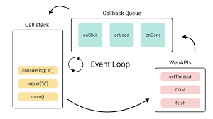

# Asynchronous Javascript

1. სინქრონული (კონტროლის ერთი ნაკადი):

კოდი სრულდება თანმიმდევრობით, თითო ოპერაცია სრულდება მეორეს დაწყებამდე.
თუ პროცესს დრო სჭირდება (მაგ., მონაცემების კითხვა ან მოლოდინი), მთლიანი პროგრამა ჩერდება.
დადებითი: მარტივი ლოგიკა და მართვა.
უარყოფითი: დიდი დროის პროცესები აბრკოლებენ პროგრამის სხვა ნაწილების მუშაობას.

2. სინქრონული (კონტროლის ორი ნაკადი):

რამდენიმე ნაკადი (threads) გამოიყენება კოდის პარალელური შესრულებისთვის.
თითო ნაკადზე პროცესები ისევ თანმიმდევრულად სრულდება.
დადებითი: შესაძლებელია პარალელური ოპერაციები.
უარყოფითი: რესურსების მართვა რთულია, რამაც შეიძლება გამოიწვიოს პროგრამის დესტაბილიზაცია.

3. ასინქრონული:

პროცესები იწყება, მაგრამ მათი დასრულება არ ბლოკავს პროგრამის ძირითად ნაკადს.
გამოყენებულია Callback-ები, Promises, ან Async/Await ფუნქციები.
დადებითი: უფრო ეფექტური მუშაობა და რესურსების ნაკლები გამოყენება.
უარყოფითი: ლოგიკა შეიძლება გახდეს რთულად გასაგები (callback hell, error-handling).


## Callback functions

რა არის Callback?
Callback არის ფუნქცია, რომელიც გადაეცემა სხვა ფუნქციას არგუმენტად და შესრულდება მას შემდეგ, რაც ეს ფუნქცია კონკრეტულ ოპერაციას დაასრულებს.

**სრულიად ასინქრონული მექანიზმი:**

- Callback-ები ფართოდ გამოიყენება ასინქრონულ JavaScript-ში, როდესაც ოპერაციის შედეგს ვერ ვიღებთ მყისიერად (მაგ., დროის დაგვიანება ან ფაილის წაკითხვა).

**მაგალითები:**

1. setTimeout: ფუნქცია `setTimeout` იღებს Callback-ს და ასრულებს მას მითითებული დროის შემდეგ.

```js
setTimeout(() => console.log("Tick"), 500);
// → Tick (500 მილიწამში)
```

2. **ფაილის წაკითხვა (readTextFile):**
   Callback გამოიყენება ფაილის შიგთავსის წასაკითხად:

```js
readTextFile("shopping_list.txt", (content) => {
  console.log(`Shopping List:\n${content}`);
});
// → Shopping List:
// → Peanut butter
// → Bananas
```

**Callback-ის დადებითი:**

გაწვდილი ლოგიკის მართვა (პროცესის დასრულების შემდეგ მოქმედება).
მარტივი გზა ასინქრონული ოპერაციების დასაწყობად.

**Callback-ის უარყოფითი:**

Callback Hell: ერთმანეთში ჩახლართული Callback-ები ართულებს კოდის წაკითხვას და მხარდაჭერას.

## Promise

**რა არის Promise?**
Promise(ობიექტი, რომელიც შეიცავს რაღაც გარკვეულ ინფორმაციას, რომელიც ახლა არ გვაქვს, მაგრამ გვპირდება რომ მოგვცემს) არის ასინქრონული ოპერაციების შედეგის მართვის მექანიზმი, რომელიც ორ მდგომარეობაში შეიძლება იყოს:

1. გადაჭრილი (Resolved): ოპერაცია წარმატებით დასრულდა და მივიღეთ შედეგი.
2. უარყოფილი (Rejected): ოპერაცია ჩავარდა და მივიღეთ შეცდომა.

სანამ ფრომისი დარეზოლვდება ან დარეჯექთდება, ის არის Pending მდგომარეობაში.

**Promise-ის ფუნქციონალი:**

- .then(): გამოიყენება გადაჭრილი შედეგის მისაღებად.
- .catch(): გამოიყენება შეცდომების დასაჭერად.
  .finally(): გამოიყენება ოპერაციის \* დასრულების შემდეგ (თუ შედეგი ან შეცდომაა).

**მაგალითი:**

```js
let fifteen = Promise.resolve(15);
fifteen.then((value) => console.log(`Got ${value}`));
// → Got 15
```

**რას აკეთებს ეს კოდი?**

1. Promise.resolve(15) ქმნის გადასაწყვეტ (resolved) Promise-ს, რომლის მნიშვნელობაა 15.
2. then იღებს ფუნქციას, რომელიც შესრულდება, როცა Promise-ის მდგომარეობა გადავა "resolved"-ში და ბეჭდავს:

```
Got 15
```

**Promise-ის უპირატესობები:**

- უკეთესი ალტერნატივაა Callback-ებისა.
- მარტივი და ორგანიზებული გზაა ასინქრონული ოპერაციების სამართავად.
- .then() საშუალებას გვაძლევს შევქმნათ ჯაჭვები (chaining), რაც კოდის გასაგებს ხდის.

**Promise-ის ნაკლოვანებები:**

- რთული გამოსაყენებელია ძალიან დიდი რაოდენობის ასინქრონულ ოპერაციებთან, თუ ისინი ერთმანეთზე არიან დამოკიდებულები.
- შეიძლება ზედმეტად კომპლექსური გახდეს, თუ არასწორად გამოიყენება.

## resolve

`resolve` არის ფუნქცია, რომელიც გამოიყენება Promise-ის წარმატებული შესრულების დროს. მისი დახმარებით, გადაეცემა მონაცემები .`then()` მეთოდს.

```js
const x = 20;
const y = 15;

const promise = new Promise((resolve, reject) => {
  setTimeout(() => {
    if (x > y) {
      resolve("Resolved successfully");
    }
  }, 2000);
});

promise.then((message) => console.log(message));
```

## reject

`reject` არის ფუნქცია, რომელიც გამოიყენება Promise-ის წარუმატებელი შესრულების დროს. მისი დახმარებით, Promise გადადის "Rejected" მდგომარეობაში, და შეცდომა გადაეცემა `.catch() ` მეთოდს.

```js
const x = 10;
const y = 15;

const promise = new Promise((resolve, reject) => {
  setTimeout(() => {
    if (x > y) {
      resolve("Resolved successfully");
    } else {
      reject("Failed");
    }
  }, 2000);
});

promise
  .then((message) => console.log(message))
  .catch((error) => console.log(error));
```

## Event Loop

**Event Loop-ის როლი:**
JavaScript-ის Event Loop არის მექანიზმი, რომელიც მართავს ასინქრონულ ოპერაციებს და უზრუნველყოფს, რომ მათ შედეგები სწორად შესრულდეს Call Stack, Callback Queue, და Web APIs-ის გამოყენებით.

```js
console.log("Start");

setTimeout(() => {
  console.log("Timeout callback");
}, 0);

console.log("End");
```

1. სინქრონული ოპერაცია:

```js
console.log("Start");
```

- ეს მყისიერად დაიბეჭდება და Call Stack-იდან მოიხსნება.

- მიღებული შედეგი:

```js
Start;
```

2. ასინქრონული ოპერაცია:

```js
setTimeout(() => {
  console.log("Timeout callback");
}, 500);
```

- Web APIs უძღვება setTimeout ოპერაციას.
- 500 მილიწამში Callback გადაინაცვლებს Callback Queue-ში.

3. სინქრონული ოპერაცია (გაგრძელება):

```js
console.log("End");
```

- Call Stack-ში ბრუნდება და მყისიერად გამოიტანს:

```
End
```

4. Event Loop:

- როცა Call Stack ცარიელია, Event Loop იღებს Callback Queue-დან Timeout callback-ს და ასრულებს.
  მიღებული შედეგი:

```js
Timeout callback
```

მიღებული სრული შედეგი:

```js
Start
End
Timeout callback
```

Event Loop არის მექანიზმი, რომელიც მართავს JavaScript-ის ასინქრონულ კოდს. მიუხედავად იმისა, რომ JavaScript მუშაობს ერთ ნაკადზე, Event Loop-ი უზრუნველყოფს, რომ ასინქრონულმა ოპერაციებმა (მაგ. setTimeout, fetch) არ დაბლოკონ სხვა კოდის შესრულება. Web APIs ასრულებენ ასინქრონულ ოპერაციებს, რომლებიც დასრულების შემდეგ გადადიან Callback Queue-ში, და Event Loop უწყვეტად ამოწმებს, როცა Call Stack თავისუფალია, რათა შესრულდეს Callback ფუნქციები.



## Fetching the data

```js
fetch("https://jsonplaceholder.typicode.com/posts")
  .then((response) => {
    return response.json(); // Parse the JSON data
  })
  .then((data) => {
    console.log(data); // Handle the fetched data
  })
  .catch((error) => {
    console.error("There was a problem with the fetch operation:", error); // Handle errors
  });
```

**მუშაობის ახსნა:**

- fetch() ფუნქცია ასრულებს HTTP მოთხოვნას და იღებს პასუხს.
- პირველ .then()-ში პასუხი კონვერტირდება JSON ფორმატში. response ობიექტიდან ამოგვაქვს მთავარი ინფორმაცია. ეს პროცესი არის ასინქრონული, ბრუნდება ფრომისი, ამიტომ გვიწევს კიდევ ერთი then მეთოდის გამოყენება რათა დავიჭიროთ დარეზოლვებული პასუხი, ანუ მოთხოვნილი ინფორმაცია.
- მეორე .then()-ში, კონვერტირებული მონაცემები მიიღება და იბეჭდება კონსოლში.
- .catch() მართავს ნებისმიერ შეცდომას, რომელიც შეიძლება მოხდეს fetch ოპერაციის დროს (მაგ. ქსელის პრობლემა).

## async await

```js
async function fetchData() {
  const response = await fetch("https://jsonplaceholder.typicode.com/posts");
  const data = await response.json();
  console.log(data);
}

fetchData();
```

**მუშაობის ახსნა:**

- async ფუნქცია ნიშნავს, რომ შიგნით გამოიყენება await და ის ყოველთვის დააბრუნებს ფრომისს.
- await უცდის ფრომისის დასრულებას (მაგ. fetch და response.json()), სანამ შემდეგი კოდის შესრულება გაგრძელდება.
- fetchData() ფუნქცია ასინქრონულად იღებს მონაცემებს და აბრუნებს მათ.
  ამ მიდგომით კოდი უფრო მარტივი და ადვილად წასაკითხი ხდება, ვიდრე ჩასაშლელი then()-ის გამოყენებით.
